# UrbanEats - Scalable Q-Commerce Android Application 🍔


## 📱 Project Overview

**UrbanEats** is a production-grade, offline-first food delivery ecosystem consisting of a User Application for ordering and an Admin Dashboard for business management. It features a robust Node.js backend, role-based access control (RBAC), and a modern, reactive Android UI.

- **Role:** Full Stack (Android + Node.js Backend)
- **Architecture:** Single-Activity, Multi-Module Clean Architecture (MVVM)
- **Goal:** To build a scalable, fault-tolerant e-commerce platform with real-time capabilities and automated CI/CD pipelines.

---


## 📸 Screenshots

👤 User Application

| Home Feed | Details |Search & Explore | Cart | Profile |
| :---: | :---: | :---: | :---: | :---: |
| 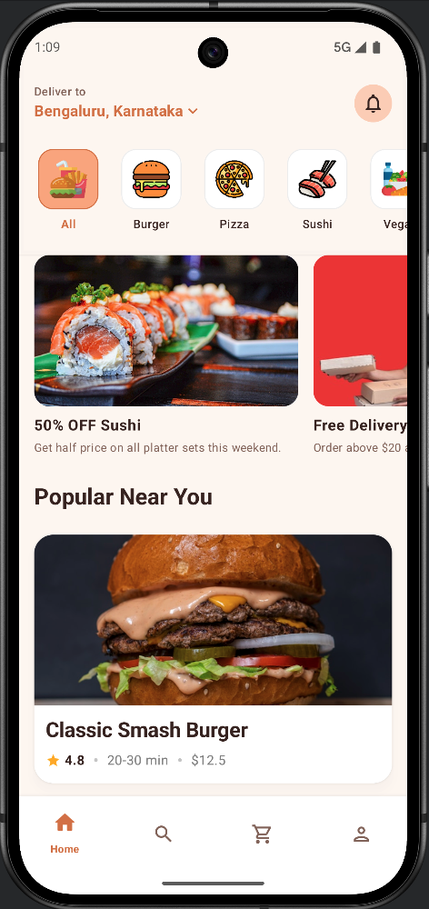 | 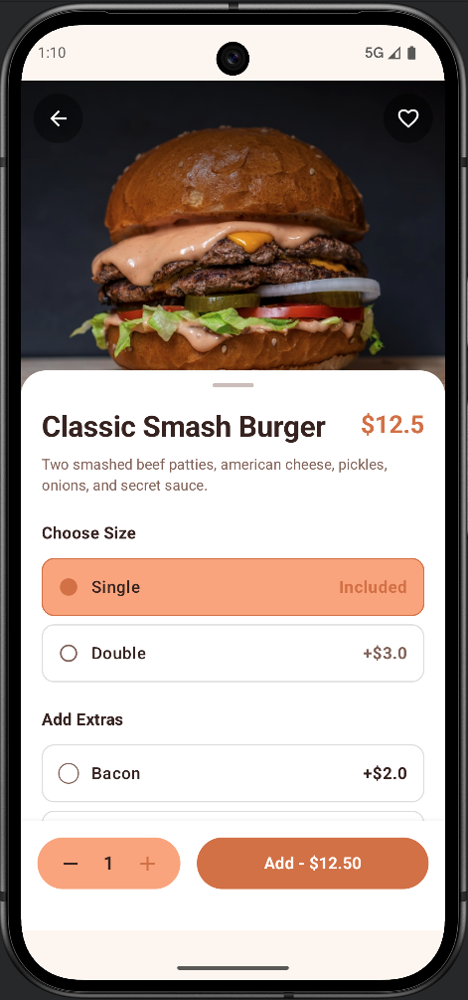 | 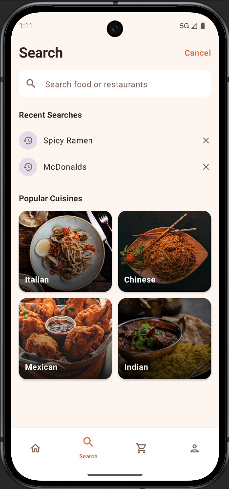 | 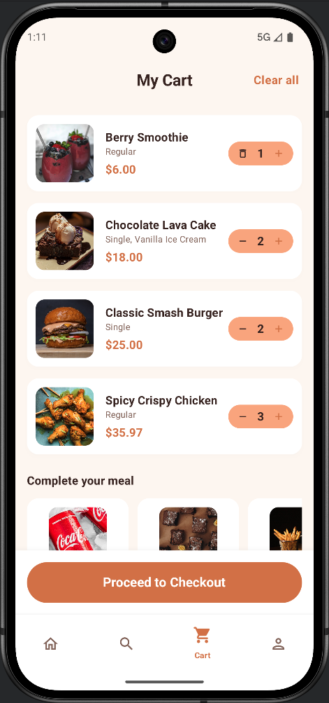 | 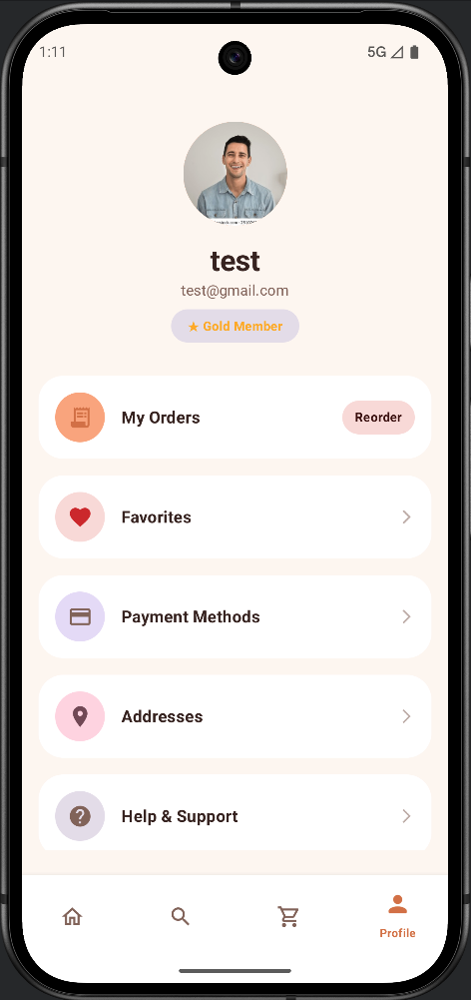 |

| Login | Signup | Checkout | Order Success | Track Order |
| :---: | :---: | :---: | :---: | :---: |
| 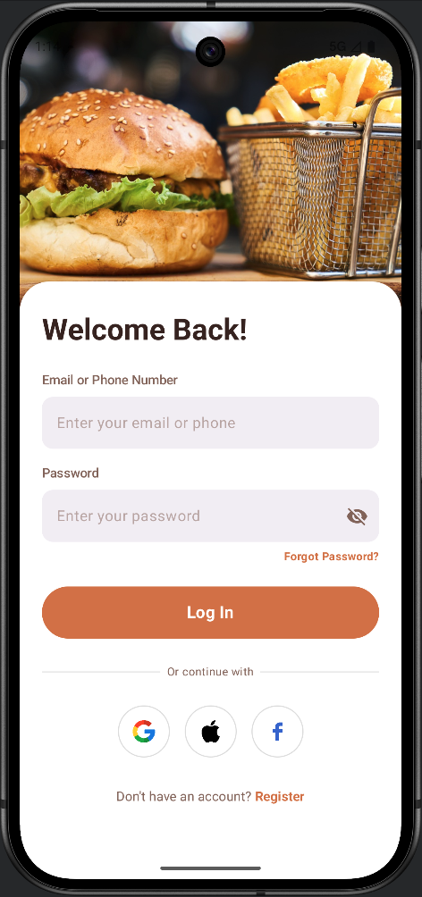 | 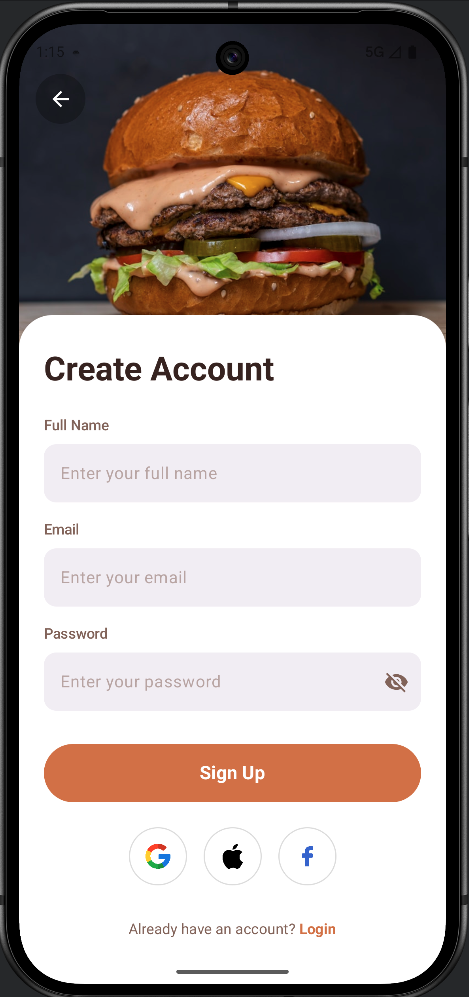 | 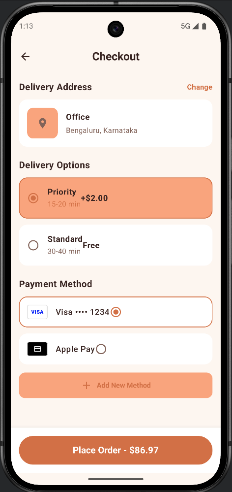 | 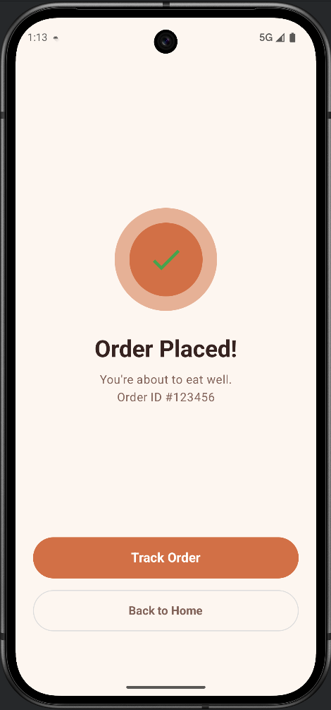 | 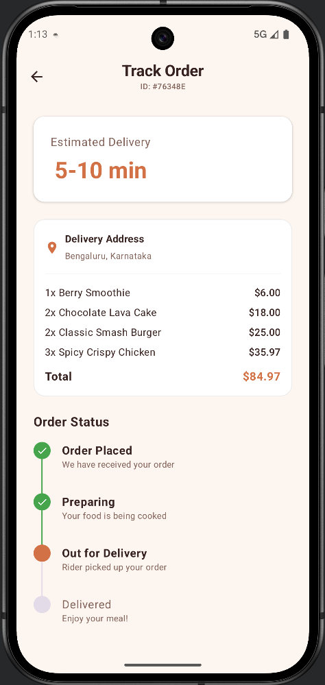 |

🛡️ Admin Dashboard

| Orders | Manage Menu | Admin Profile | Splash |
| :---: | :---: | :---: | :---: |
| 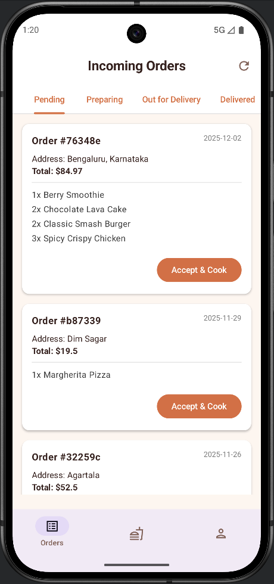 | 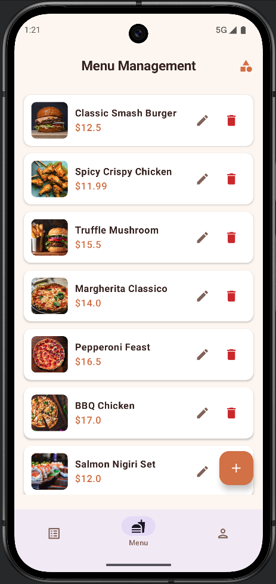 | 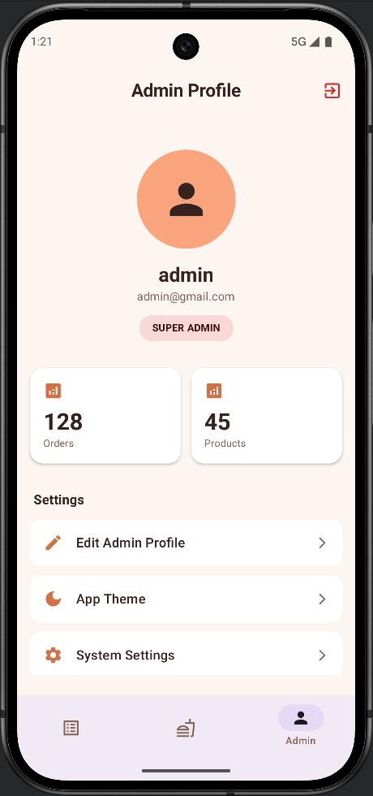 | 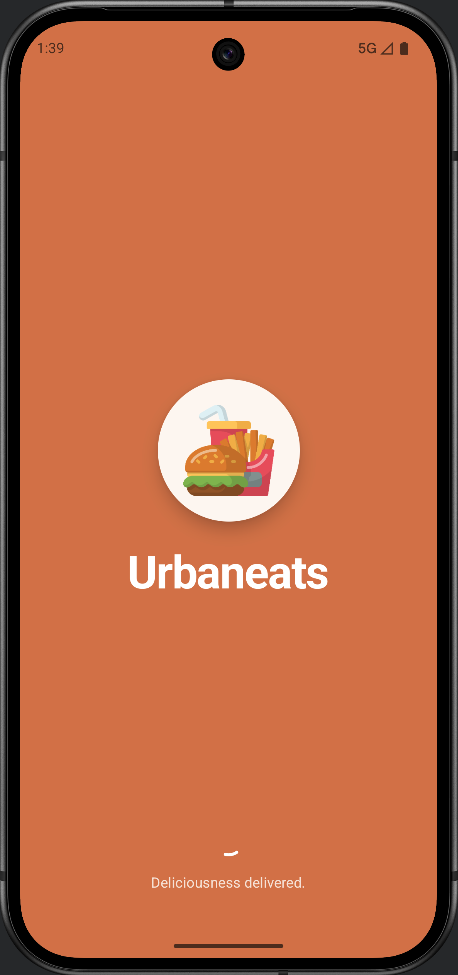 |

---

## 🛠 Tech Stack & Architecture

This project adheres to **Modern Android Development (MAD)** guidelines.

### 🤖 Android Client
* **Architecture:** Clean Architecture (Presentation, Domain, Data layers) with MVVM/MVI pattern.
* **UI:** 100% Jetpack Compose (Material 3 Design System) with custom theming.
* **Dependency Injection:** Koin (Lightweight, Kotlin-first framework).
* **Networking:** Ktor Client (Multiplatform-ready engine with content negotiation).
* **Local Database:** Room (SQLite) for offline caching and Single Source of Truth (SSOT).
* **Async Processing:** Kotlin Coroutines & Flows (StateFlow/SharedFlow).
* **Background Work:** WorkManager (Simulated Order Notifications).
* **Image Loading:** Coil.
* **Navigation:** Type-safe Jetpack Navigation Compose.

### ⚙️ Backend & DevOps
* **Backend:** Node.js, Express.js.
* **Database:** MongoDB Atlas (Mongoose ODM).
* **Media Storage:** Cloudinary API for optimized image storage (Product & Profile images).
* **Security:** JWT (JSON Web Tokens) for session management and Role-Based Access Control.
* **DevOps:** GitHub Actions for CI/CD (Automated Testing & Release Builds)..

---

## 🚀 Key Features

### For Users


* **Offline-First Experience:** Users can browse the menu and view their cart even without internet. The app syncs when connectivity returns.
* **Dynamic Product Options:** Products support server-driven sizes and add-ons (e.g., "Extra Cheese"), configured via the backend.
* **Real-time Search:** Optimized search with Debouncing to reduce API calls and server load.
* **Persistent Cart:** Cart state is saved locally in Room database and survives app kills/restarts.
* **Order Tracking:** Simulated real-time tracking timeline with background notifications using WorkManager.
* **Secure Authentication:** JWT-based auth with auto-login and secure session management (DataStore).
* **User Profile:** Full CRUD for user profile, including image upload to Cloudinary.
* **Theme Engine:** Supports Light, Dark, and System Default modes with immediate UI updates.
* **Address Management:** Multi-address support synced with the server.

### For Admins


* **Menu Management:** Full CRUD (Create, Read, Update, Delete) for products and categories.
* **Order Processing:** View incoming orders and update status (Pending -> Preparing -> Delivered).
* **RBAC:** Secure login flow that redirects users based on their role (Admin vs. Customer).
---

## 🏗 Architecture Diagram

The app strictly follows the **Single Source of Truth (SSOT)** principle. The UI observes the Database, while the Repository manages data synchronization.

```mermaid
graph TD
    subgraph "Presentation Layer"
        UI[Compose Screens] -->|Events| VM[ViewModel]
        VM -->|StateFlow| UI
    end
    subgraph "Domain Layer"
        VM -->|Invokes| UC[Use Cases]
        UC -->|Calls| Repo[Repository Interface]
    end
    subgraph "Data Layer"
        Repo -->|Implements| RepoImpl[Repository Impl]
        RepoImpl -->|Reads/Writes| DB[(Room Database)]
        RepoImpl -->|Fetches| API[Ktor Client]
        API <-->|JSON| Backend[Node.js Server]
    end 
  ```

-----

## 🔧 Setup & Installation

### Prerequisites

* Android Studio Koala/Ladybug or newer.
* Node.js (for local backend).
* MongoDB Atlas Account.

### 1\. Backend Setup

```bash
cd backend
npm install
# Create a .env file in /backend with:
# DB_CONNECT=your_mongodb_url
# TOKEN_SECRET=your_jwt_secret
# CLOUDINARY_CLOUD_NAME=...
# CLOUDINARY_API_KEY=...
# CLOUDINARY_API_SECRET=...

node server.js

````

### 2\. Android Setup

1.  Clone the repository:
    ```bash
    git clone [https://github.com/ShuhamDebnath/UrbanEats-Android.git](https://github.com/ShuhamDebnath/UrbanEats-Android.git)
    ```
2.  Open the project in Android Studio.
3.  Wait for Gradle Sync to finish.
4.  Run on an Emulator or Physical Device.

-----

## 🧪 Testing

The project includes comprehensive tests to ensure reliability.

* **Unit Tests:** For ViewModels and UseCases (Logic verification).
* **Instrumented Tests:** For Room Database and basic UI flows.

Run tests via terminal:

```bash
./gradlew testDebugUnitTest
```

-----

## 🤝 Contact

**Suham Debnath**

[LinkedIn Profile](https://www.linkedin.com/in/shuham-debnath-74970a292/) | [Email Me](mailto:shuhamdebnath55@gmail.com)

-----

## 📄 License

This project is for educational purposes and portfolio demonstration.